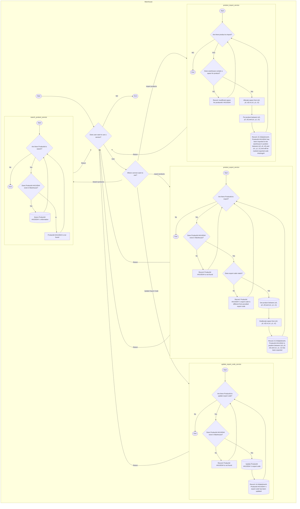

# Warehouse Services

- Exported code คือ code ที่ reference ถึงปลายทางของ product ที่จะไป ขึ้นอยู่กับ level ของปลายทาง เช่น ภาค, จังหวัด, อำเภอ, ตำบล, พื้นที่

```mermaid
flowchart TD

subgraph Warehouse

ST(["Start"])

ST --> A

A{"Does user want to use a service?"}

A  -- NO --> B(["End"])

A  -- YES --> C{"What is service want to use?"}


C  -- import products --> product_import_service

subgraph product_import_service

D(["Start"]) --> DA{"Are there product to import?"}

DA  -- NO --> DB(["End"])


DA  -- YES --> DC{"Does warehouse contain a space for product?"}

DC  -- NO --> DD


DD["Record: insufficient space for produceId: ##UUID##"]


DD --> DA

DC  -- Yes --> DE


DE["Allocate space from (x0, y0, z0) to (x1, y1, z1)"] --> DF["Put product between (x0, y0, z0) and (x1, y1, z1)"]

DF --> DG[("Record: At ##datetime##, ProductId ##UUID## has been imported to the warehouse in position between (x0, y0, z0) and (x1, y1, z1) and will be marked exported code ##string##")]


DG --> DA


end

product_import_service  --Return--> A


C  -- export products --> product_export_service

product_export_service --Return--> A

subgraph product_export_service

E(["Start"]) --> EA{"Are there ProductId to export?"}

EA  -- No --> EB(["End"])

EA  -- Yes--> EC{"Does ProductId ##UUID## exist in Warehouse?"}

EC  -- No --> ED


ED["Record: ProductId ##UUID## is not found"]


ED --> EA


EC  -- Yes --> EE{"Does export code match?"}


EE  --No --> EF

EE  -- Yes --> EG


EF["Record: ProductId ##UUID## 's export code is different from provided export code"]


EF --> EA


EG[("Get product between (x0, y0, z0) and (x1, y1, z1)")] --> EH["Deallocate space from (x0, y0, z0) to (x1, y1, z1)"]

EH --> EI[("Record: At ##datetime##, ProductId ##UUID## in position between (x0, y0, z0) and (x1, y1, z1) has been exported")]


EI -->  EA


end


product_export_service  --Return--> A


C  -- Update Export Code --> update_export_code_service


subgraph update_export_code_service

F(["Start"]) --> FA{"Are there ProductId to update export code?"}


FA  -- No --> FB(["End"])

FA  -- Yes--> FC{"Does ProductId ##UUID## exist in Warehouse?"}


FC  -- No -->  FD


FD["Record: ProductId ##UUID## is not found"]


FD --> FA


FC  -- Yes --> FE

FE[("Update ProductId ##UUID## 's export code")] --> FG[("Record: At ##datetime##, ProductId ##UUID## 's export code has been updated")]


FG --> FA


end


update_export_code_service  --Return-->  A


C  -- Search products -->  search_product_service


subgraph search_product_service

GA(["Start"]) --> GB{"Are there ProductId to search?"}

GB  --No --> GC(["End"])


GB  -- Yes --> GD


GD{"Does ProductId ##UUID## exist in Warehouse?"}

GD -- No--> GE["ProductId ##UUID## is not found"]

GD -- Yes --> GH[("Query ProductId ##UUID## 's information")]

GE ----> GB

GH --> GB


end


search_product_service  --Return--> A


end
```